# Smart Document Editor Documentation

## 1. System Overview

The Smart Document Editor is a modular Java system that supports creating, editing, formatting, exporting, extending, and versioning structured documents.

The document model is hierarchical:

- Document
- Section
- Elements (Paragraph, Image, Table, Header, Footer)

Key capabilities:

- Step-by-step document creation
- Runtime editing with undo/redo
- Export to PDF/HTML/DOCX and bonus JSON/XML
- Flyweight style sharing for memory efficiency
- Plugin-based extension mechanism
- Observer-driven auto-save and live preview notifications
- Visitor-based cross-cutting operations (word count, spell check)
- Collaboration simulation with concurrent editor actions
- Internal version control snapshots and checkout
- Swing GUI mockup for interactive editing

## 2. Design Patterns Applied

### 2.1 Singleton

Used for core service coordinators:

- `DocumentManager`
- `PluginManager`
- `ExportManager`

Rationale:

- A single source of truth for active document state and global extension registries.

### 2.2 Factory Method

`DocumentElementFactory` creates leaf element types:

- Paragraph
- ImageElement
- TableElement
- Header
- Footer

Rationale:

- Encapsulates element instantiation and centralizes element creation rules.

### 2.3 Abstract Factory

`ExporterFactory` defines a family contract for exporters. Concrete factories:

- `PdfExporterFactory`
- `HtmlExporterFactory`
- `DocxExporterFactory`
- `JsonExporterFactory` (bonus)
- `XmlExporterFactory` (bonus)

Rationale:

- Supports adding export families without modifying the export manager logic.

### 2.4 Builder

`DocumentBuilder` provides fluent, stepwise construction.

Rationale:

- Improves readability for complex document assembly and avoids telescoping constructors.

### 2.5 Prototype

`DocumentComponent.deepCopy()` clones elements and full trees.

Rationale:

- Enables reuse and fast snapshot creation for version control.

### 2.6 Flyweight

`StyleFlyweightFactory` stores/reuses immutable `TextStyle` objects.

Rationale:

- Reduces memory by sharing intrinsic style data across components.

### 2.7 Composite

`DocumentComponent` is the base composite. Concrete composites/leaves:

- Composite: `Document`, `Section`
- Leaf: `Paragraph`, `ImageElement`, `TableElement`, `Header`, `Footer`

Rationale:

- Uniform treatment of tree nodes enables traversal, rendering, and visitor support.

### 2.8 Command

`Command` interface with concrete commands:

- `InsertTextCommand`
- `DeleteTextCommand`
- `FormatChangeCommand`

`CommandManager` stores undo/redo stacks.

Rationale:

- Encapsulates state-changing requests and gives reversible editing history.

### 2.9 Strategy

Formatting strategies:

- `UpperCaseFormattingStrategy`
- `TitleCaseFormattingStrategy`

Export strategy is selected by format registration in `ExportManager`.

Rationale:

- Enables interchangeable formatting and export behavior at runtime.

### 2.10 Observer (Bonus)

Observers:

- `AutoSaveObserver`
- `LivePreviewObserver`

`DocumentManager` emits `DocumentEvent` notifications on state changes.

Rationale:

- Decouples change producers from reactive side effects (save/preview).

### 2.11 Visitor (Bonus)

Visitors:

- `WordCountVisitor`
- `SpellCheckVisitor`

Rationale:

- Adds operations over document structure without modifying element classes.

## 3. Pattern Interactions

1. `DocumentBuilder` uses `DocumentElementFactory` to create model elements.
2. Model elements use `TextStyle` flyweights from `StyleFlyweightFactory`.
3. `DocumentManager` executes `Command` objects and notifies `DocumentObserver`s.
4. `ExportManager` resolves export format to an `ExporterFactory` and runs a `DocumentExporter` strategy.
5. `PluginManager` initializes plugins with shared singleton managers.
6. `VersionControlService` uses prototype cloning (`deepCopy`) for snapshots.
7. `CollaborationSession` concurrently submits commands to `DocumentManager`.
8. Visitors traverse the composite model for analytics/checking operations.

## 4. Bonus Features

### 4.1 Swing GUI

`SmartDocumentEditorFrame` includes:

- Text area editing for a paragraph
- Apply text command
- Undo/Redo
- Word count dialog
- HTML export button

### 4.2 JSON/XML Export

Implemented as concrete exporters and factories in the same abstract factory family.

### 4.3 Plugin System

- `Plugin` contract
- `PluginManager` runtime registry
- Java `ServiceLoader` integration
- `WordFrequencyPlugin` sample plugin

### 4.4 Real-Time Collaboration Simulation

`CollaborationSession` runs editor actions in a thread pool, each action executing a command.

### 4.5 Version Control

`VersionControlService` supports:

- commit(document, message)
- history()
- checkout(versionId)

## 5. UML Class Diagram (Mermaid)

```mermaid
classDiagram
    class DocumentComponent {
      +String id
      +TextStyle style
      +add(DocumentComponent)
      +remove(DocumentComponent)
      +findById(String)
      +render() String
      +deepCopy() DocumentComponent
      +accept(DocumentVisitor)
    }

    class Document
    class Section
    class Paragraph
    class ImageElement
    class TableElement
    class Header
    class Footer

    DocumentComponent <|-- Document
    DocumentComponent <|-- Section
    DocumentComponent <|-- Paragraph
    DocumentComponent <|-- ImageElement
    DocumentComponent <|-- TableElement
    DocumentComponent <|-- Header
    DocumentComponent <|-- Footer
    DocumentComponent "1" o-- "*" DocumentComponent : children

    class TextStyle
    class StyleFlyweightFactory {
      +getStyle(...) TextStyle
    }
    StyleFlyweightFactory --> TextStyle : shares

    class DocumentElementFactory {
      <<interface>>
      +createParagraph(String)
      +createImage(String,String)
      +createTable(List)
      +createHeader(String)
      +createFooter(String)
    }
    class DefaultDocumentElementFactory
    DocumentElementFactory <|.. DefaultDocumentElementFactory

    class DocumentBuilder {
      +start(String)
      +addSection(String)
      +addParagraph(String,TextStyle)
      +build() Document
    }
    DocumentBuilder --> DocumentElementFactory
    DocumentBuilder --> Document

    class Command {
      <<interface>>
      +execute()
      +undo()
      +name() String
    }
    class InsertTextCommand
    class DeleteTextCommand
    class FormatChangeCommand
    Command <|.. InsertTextCommand
    Command <|.. DeleteTextCommand
    Command <|.. FormatChangeCommand

    class CommandManager {
      +execute(Command)
      +undo()
      +redo()
    }

    class DocumentManager {
      <<singleton>>
      +execute(Command)
      +undo()
      +redo()
      +setCurrentDocument(Document)
    }
    DocumentManager --> CommandManager
    DocumentManager --> Document

    class DocumentObserver {
      <<interface>>
      +onDocumentChanged(DocumentEvent)
    }
    class AutoSaveObserver
    class LivePreviewObserver
    DocumentObserver <|.. AutoSaveObserver
    DocumentObserver <|.. LivePreviewObserver
    DocumentManager --> DocumentObserver

    class ExportManager {
      <<singleton>>
      +registerFactory(ExporterFactory)
      +export(String,Document,Path)
    }
    class ExporterFactory {
      <<interface>>
      +format() String
      +createExporter() DocumentExporter
    }
    class DocumentExporter {
      <<interface>>
      +export(Document,Path)
    }

    class PdfExporterFactory
    class HtmlExporterFactory
    class DocxExporterFactory
    class JsonExporterFactory
    class XmlExporterFactory
    ExporterFactory <|.. PdfExporterFactory
    ExporterFactory <|.. HtmlExporterFactory
    ExporterFactory <|.. DocxExporterFactory
    ExporterFactory <|.. JsonExporterFactory
    ExporterFactory <|.. XmlExporterFactory

    class PdfExporter
    class HtmlExporter
    class DocxExporter
    class JsonExporter
    class XmlExporter
    DocumentExporter <|.. PdfExporter
    DocumentExporter <|.. HtmlExporter
    DocumentExporter <|.. DocxExporter
    DocumentExporter <|.. JsonExporter
    DocumentExporter <|.. XmlExporter

    class FormattingStrategy {
      <<interface>>
      +apply(Paragraph)
    }
    class UpperCaseFormattingStrategy
    class TitleCaseFormattingStrategy
    FormattingStrategy <|.. UpperCaseFormattingStrategy
    FormattingStrategy <|.. TitleCaseFormattingStrategy

    class Plugin {
      <<interface>>
      +name() String
      +initialize(PluginContext)
      +execute(Document)
    }
    class PluginManager {
      <<singleton>>
      +register(Plugin)
      +loadFromServiceLoader()
      +execute(String,Document)
    }
    class WordFrequencyPlugin
    Plugin <|.. WordFrequencyPlugin
    PluginManager --> Plugin

    class DocumentVisitor {
      <<interface>>
      +visitDocument(Document)
      +visitSection(Section)
      +visitParagraph(Paragraph)
    }
    class WordCountVisitor
    class SpellCheckVisitor
    DocumentVisitor <|.. WordCountVisitor
    DocumentVisitor <|.. SpellCheckVisitor
    DocumentComponent --> DocumentVisitor

    class CollaborationSession
    CollaborationSession --> DocumentManager

    class VersionControlService {
      +commit(Document,String)
      +history() List
      +checkout(int) Document
    }
    VersionControlService --> Document
```

## 6. Design Justification

1. The architecture is modular by package and clear by responsibility.
2. Required patterns are not isolated demos; they interact in runtime flows.
3. Memory efficiency is improved by immutable flyweight styles and snapshot cloning only on version commit.
4. Extensibility is achieved through abstract exporter family registration and plugin interface-based runtime extension.
5. Runtime behavior stays dynamic via command undo/redo, strategy swapping, observer notifications, and visitor execution.

## 7. How to Demonstrate

1. Run `mvn exec:java` to execute end-to-end flow.
2. Check generated exports in `exports/`.
3. Check auto-save output in `autosave/latest.txt`.
4. Run `mvn exec:java -Dexec.args="--gui"` for GUI mode.
5. Run `mvn test` for verification.
